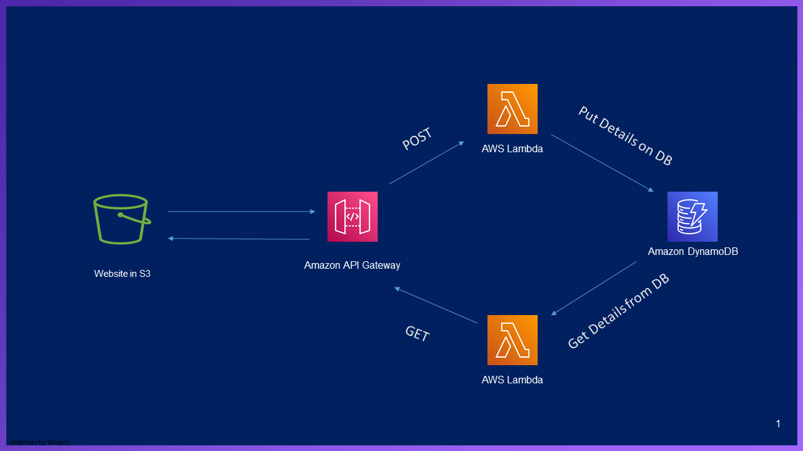

# Serverless Dynamic Website

## Architecture
<p align="center">
   
</p>

# Steps to replicate
* Setup S3 public bucket
	1. Create a public bucket with below bucket policy
	```bash
	{
    "Version": "2012-10-17",
    "Statement": [
        {
            "Sid": "PublicRead",
            "Effect": "Allow",
            "Principal": "*",
            "Action": [
                "s3:GetObject",
                "s3:GetObjectVersion"
            ],
            "Resource": "arn:aws:s3:::#bucketname#/*"
        }
    ]
	}
	```
	1. Edit "userDetails.html" and modify the below in line 41 to add API gateway connection url "
	```bash
	fetch("#API_gateway_Connection_URL#/dev", requestOptions)"
	```
	1. Edit "index.html" and modify the below in line 22 to add API gateway connection url "
	```bash
	url: '#API_gateway_Connection_URL#/dev',
	```
	1. Upload "jquery-3.1.1.min","knockout-3.4.2","index.html" and "userDetails.html"

<!-- 1. item1
1. item2
    1. subitem1
    2. subitem2 -->

